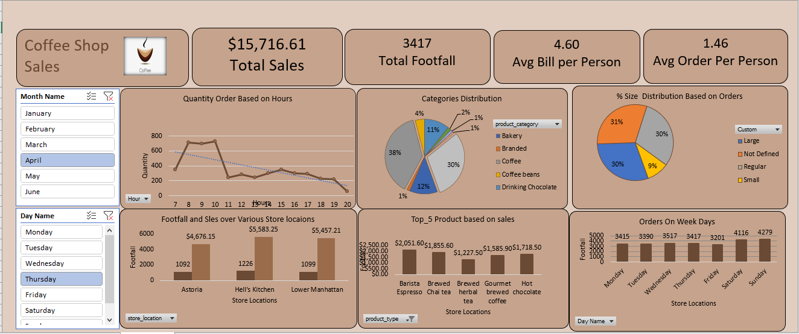

# ☕ Coffee Shop Sales Dashboard

<p align="center">


</p>

---

## 📌 Project Overview

The **Coffee Shop Sales Dashboard** is an interactive business intelligence project developed in **Microsoft Excel**. It transforms raw coffee shop sales data into meaningful insights using Pivot Tables, Pivot Charts, KPIs, Slicers, and Data Visualization techniques.

This dashboard enables business owners and decision-makers to monitor sales performance, customer behavior, product demand, and store performance through an intuitive interface.

---

## 📸 Dashboard Preview

<p align="center">

</p>

---

## 🎯 Business Objectives

This dashboard answers important business questions such as:

- 📅 How do sales vary by **day** and **hour**?
- 📈 What are the **peak sales hours**?
- 💰 What is the **monthly sales revenue**?
- 🏪 Which **store location** performs the best?
- 👥 What is the **average bill per customer**?
- ☕ Which products generate the highest revenue?
- 📊 How do product categories contribute to total sales?

---

## ✨ Dashboard Features

- 💰 Total Sales KPI
- 👣 Total Footfall
- 🧾 Average Bill Per Person
- 🛒 Average Orders Per Person
- 📅 Monthly Sales Analysis
- ⏰ Hourly Sales Trend
- 📍 Store-wise Sales Comparison
- ☕ Top 5 Best-Selling Products
- 🥧 Product Category Distribution
- 📊 Product Size Distribution
- 🎛 Interactive Month & Day Slicers

---

## 🛠 Tools & Technologies

| Tool | Purpose |
|------|---------|
| Microsoft Excel 2021 | Dashboard Development |
| Pivot Tables | Data Summarization |
| Pivot Charts | Data Visualization |
| Slicers | Interactive Filtering |
| GETPIVOTDATA | Dynamic KPIs |
| Conditional Formatting | Visual Enhancement |

---

## 📂 Repository Structure

```
Coffee-Shop-Sales/
│
├── Coffee_Shop_Sales_Dashboard.xlsx
├── Coffee_Shop_Sales_Analysis.pdf
├── Dashboard.PNG
├── README.md
└── LICENSE
```

---

## 📊 Key KPIs

- Total Sales
- Customer Footfall
- Average Bill
- Average Orders
- Monthly Revenue
- Product Performance
- Store Performance

---

## 📈 Skills Demonstrated

- Data Cleaning
- Data Analysis
- Dashboard Design
- KPI Reporting
- Pivot Tables
- Pivot Charts
- Excel Automation
- Business Intelligence
- Data Visualization

---

## 🚀 Project Outcome

This dashboard provides actionable insights that help businesses:

- Improve sales performance
- Identify top-selling products
- Analyze customer purchasing patterns
- Compare store performance
- Support data-driven decision making

---

## 👨‍💻 Author

**Sonu Gupta**

Aspiring **Data Analyst** passionate about Excel, SQL, Power BI, and Python.

---

## ⭐ Support

If you found this project useful, please consider giving it a ⭐ Star.
